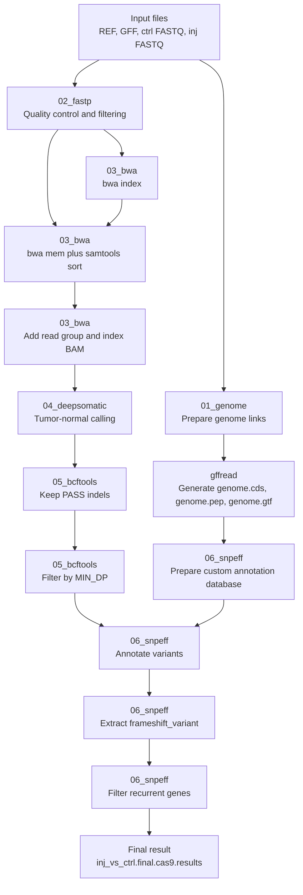

[WG-OTS_README.md](https://github.com/user-attachments/files/27503360/WG-OTS_README.md)
<p align="center">
  
</p>

<h1 align="center">WG-OTS</h1>

<p align="center">
  <b>WholeGenome OffTarget Scanner</b><br>
  A Snakemake workflow for whole-genome off-target detection and annotation from WGS data.
</p>
# WG-OTS

**WG-OTS (WholeGenome OffTarget Scanner)** is a Snakemake workflow for whole-genome off-target detection and annotation from whole-genome sequencing (WGS) data.

This workflow is designed for paired control and injected samples, and aims to identify candidate off-target mutations by integrating read preprocessing, genome alignment, somatic-style variant calling, variant filtering, functional annotation, and recurrent-gene screening.

---

## Overview

WG-OTS takes the following inputs:

- reference genome FASTA
- genome annotation GFF
- control paired-end FASTQ files
- injected paired-end FASTQ files

In the current workflow design:

- **ctrl** is treated as the **normal** sample
- **inj** is treated as the **tumor** sample

DeepSomatic is used in tumor-normal mode to detect candidate variants, after which the workflow keeps PASS indels, filters by minimum depth, annotates variants with snpEff, extracts frameshift variants, and finally retains recurrently hit genes.

---

## Workflow logic

The workflow consists of the following major steps:

### 1. Genome preparation
The reference FASTA and GFF annotation are linked into the `01_genome/` directory.

Then `gffread` is used to generate:

- `genome.cds`
- `genome.pep`
- `genome.gtf`

These files are later used for building the custom snpEff annotation database.

### 2. Read preprocessing
Raw FASTQ files from control and injected samples are processed by `fastp` to perform quality control and read filtering.

Outputs are written to `02_fastp/`.

### 3. Read alignment
Filtered reads are aligned to the reference genome using `bwa mem`, converted and sorted with `samtools sort`, and then read-group tags are added with `samtools addreplacerg`.

Outputs are written to `03_bwa/`.

### 4. DeepSomatic calling
The workflow runs **DeepSomatic** in tumor-normal mode:

- `ctrl` -> normal
- `inj` -> tumor

This step generates the primary somatic-style variant callset in VCF/gVCF format.

Outputs are written to `04_deepsomatic/`.

### 5. bcftools filtering
The DeepSomatic VCF is filtered in two stages:

1. keep only **PASS** records and **indels**
2. retain only variants with `DP >= MIN_DP`

Outputs are written to `05_bcftools/`.

### 6. snpEff database preparation
A custom snpEff annotation database is built from:

- `genome.gtf`
- `ref.fa`
- `genome.cds`
- `genome.pep`

Outputs are written to `06_snpeff/data/ann_database/`.

### 7. snpEff annotation
The filtered indel VCF is annotated using the custom snpEff database.

### 8. Frameshift extraction
Annotated variants containing `frameshift_variant` are extracted.

### 9. Recurrent-gene filtering
A custom Python script is used to retain only genes that appear in multiple variant lines, generating the final candidate result file.

---

## Workflow diagram



---

## Project structure

```text
WG-OTS/
├── Snakefile
├── config.yaml
├── env.yaml
├── example/
├── script/
│   └── filter_recurrent_genes_from_snpeff_vcf.py
```

---

## Requirements

WG-OTS requires:

- Snakemake
- Conda or Mamba
- Docker
- the DeepSomatic Docker image prepared locally before running

---

## Important note about DeepSomatic

WG-OTS does **not** automatically install the DeepSomatic Docker image.

Before running the workflow, users must prepare the image manually, for example by pulling it locally:

```bash
docker pull google/deepsomatic:1.10.0
```

If internet access is restricted, users may also prepare the image by other means such as `docker load` from a pre-downloaded image archive.

The current workflow expects the following image name to be available locally:

```text
google/deepsomatic:1.10.0
```

---

## Input configuration

The workflow is configured through `config.yaml`.

Example:

```yaml
# input
REF: "example/GCF_049306965.1_GRCz12tu_genomic.fna"
GFF: "example/genomic.gff"

ctrl_fastq1: "example/fgf10a-control_1.fq.gz"
ctrl_fastq2: "example/fgf10a-control_2.fq.gz"
inj_fastq1: "example/fgf10a-injected_1.fq.gz"
inj_fastq2: "example/fgf10a-injected_2.fq.gz"

# bcftools filter
# MIN_DP: minimum depth threshold for variant filtering.
# Recommended setting: sequencing depth × 3/4.
MIN_DP: 8

# snpEff
# SNPEFF_MEM_GB: Java heap memory (in GB) used for building the snpEff annotation database.
# Increase this value if snpEff database construction runs out of memory.
SNPEFF_MEM_GB: 200
```

---

## Run the workflow

```bash
snakemake --cores 20 --software-deployment-method conda
```

If interrupted outputs need to be rebuilt:

```bash
snakemake --cores 20 --software-deployment-method conda --rerun-incomplete
```

---

## Main outputs

Key outputs include:

- `04_deepsomatic/inj_vs_ctrl.deepsomatic.vcf.gz`
- `05_bcftools/inj_vs_ctrl.pass.indel.vcf.gz`
- `05_bcftools/inj_vs_ctrl.pass.indel.MIN_DPfilter.vcf.gz`
- `06_snpeff/inj_vs_ctrl.pass.indel.MIN_DPfilter.ann.vcf.gz`
- `06_snpeff/inj_vs_ctrl.pass.indel.MIN_DPfilter.ann.frameshift_variant.vcf.gz`
- `06_snpeff/inj_vs_ctrl.final.cas9.results`

---

## Suggested citations

If you use WG-OTS in a publication, please cite the software used in this workflow as appropriate.

### Workflow engine
- Mölder F, Jablonski KP, Letcher B, et al. Sustainable data analysis with Snakemake. *F1000Research*. 2021;10:33.
- Köster J, Rahmann S. Snakemake—a scalable bioinformatics workflow engine. *Bioinformatics*. 2012;28(19):2520–2522.

### Read preprocessing
- Chen S, Zhou Y, Chen Y, Gu J. fastp: an ultra-fast all-in-one FASTQ preprocessor. *Bioinformatics*. 2018;34(17):i884–i890.

### Read alignment
- Li H, Durbin R. Fast and accurate short read alignment with Burrows–Wheeler transform. *Bioinformatics*. 2009;25(14):1754–1760.

### SAM/BAM processing
- Li H, Handsaker B, Wysoker A, et al. The Sequence Alignment/Map format and SAMtools. *Bioinformatics*. 2009;25(16):2078–2079.

### BCF/VCF processing
- Danecek P, Bonfield JK, Liddle J, et al. Twelve years of SAMtools and BCFtools. *GigaScience*. 2021;10(2):giab008.

### Variant annotation
- Cingolani P, Platts A, Wang LL, et al. A program for annotating and predicting the effects of single nucleotide polymorphisms, SnpEff. *Fly (Austin)*. 2012;6(2):80–92.

### Somatic variant calling
- Park J, Cook DE, Chang P-C, et al. Accurate somatic small variant discovery for multiple sequencing technologies with DeepSomatic.

---

## License

MIT License
